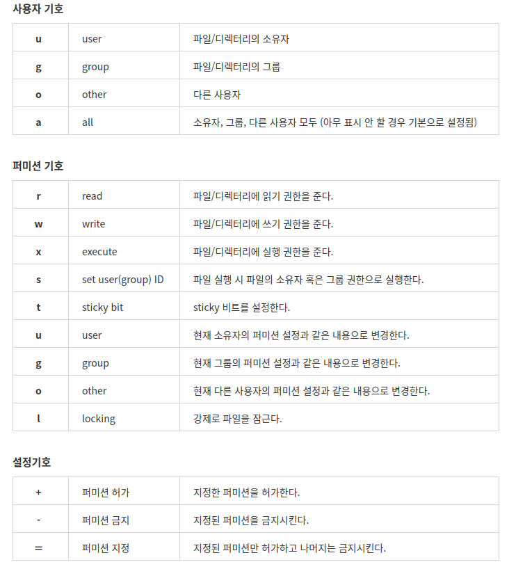

# Shell 00


shellscript를 통해 cs 구조에 대한 학습을 한다.

### ex00

---

Z 라는 이름의 파일을 만들고, 그 안에 z 라는 문자를 집어넣는 문제.
cat > (filename) 를 통해 파일을 생성 후, 내부에 원하는 내용을 집어넣는다. 
이후 ctrl + c 버튼을 통해 저장하고 나올 수 있다.

### ex01

---

날짜 및 시간, 파일의 크기, 권한설정 등을 수정 하는 문제.
chmod를 통해 파일의 읽기 쓰기 및 실행 권한을 설정 할 수 있다.
-rwxrw-r-- 와 같은 식으로 표현되는데, 각 문자는 다음과 같다.


<table>
<tr><th>-</th><th>r</th><th>w</th><th>x</th><th>r</th><th>w</th><th>x</th><th>r</th><th>w</th><th>x</th></tr>
<tr><td>파일</td><td>읽기</td><td>쓰기</td><td>실행</td><td>읽기</td><td>쓰기</td><td>실행</td><td>읽기</td><td>쓰기</td><td>실행</td></tr>
<tr style="text-align:center"><td colspan="4">Owner(User)</td><td colspan="3">Group</td><td colspan="3">Other</td></tr>
</table>

맨 앞의 파일 부분은 파일의 형식을 나타내며, 그 뒤로 세 글자씩 사용자에 대한 권한을 나타낸다.
해당 권한을 설정하면 그에 해당하는 알파벳을, 아닌 경우엔 -로 보이게끔 처리한다.

해당 권한을 변경하는 방법은 몇가지가 있는데, 기호를 사용한 접근 권한 변경 및 8진수를 통한 변경 방법 등 이 있다.



위의 기호를 조합하여, 다음과 같은 식으로 권한 변경이 가능하다.

```chmod o+r, o-r test.txt```


8진수를 사용하는 방법은 아래와 같다.

```chmod 754 [파일명]```

파일의 날짜 및 시간을 바꾸는 방법은 다음과 같으며, 이는 특정 시간으로 변경이 가능하다.

```touch -t [시간] [파일명]```

파일의 크기 변경은, vim editor를 활용해 1 byte씩 데이터를 추가해 직접 변경하는 방법이 있고, 
fallocate, truncate 등이 있다.

명령어는 다음과 같다.

```falocate -l [파일크기] [파일명]```

```truncate -s [파일크기] [파일명]```

또한, 크기가 0인 파일을 만들 땐 다음과 같다.

```touch -t [파일명]```

```echo -n > [파일명]```

```cat /dev/null > [파일명]```

/dev/null이란 null device를 말하며, 윈도우로 말하면 쓰레기통과 같아, 주로 불필요한 출력 스트림을 버리는데 사용된다.


### ex02

---

1번과 같이 날짜, 시간, 권한, 파일 크기를 수정하고,
파일의 형식 및 압축 등의 개념에 대해서 이해해야 한다.

먼저, 디렉토리(폴더)의 경우엔 위의 ex01의 표의 파일 위치에 d가 오며, 일반 파일의 경우 -가 오게 된다.
이때, l이 오는 경우가 있는데, 이를 파일 링크라고 한다.
파일 링크를 사용하는 방법은 경로 단축, 데이터의 보관 및 통일성 등을 위해 사용한다.

리눅스에서 파일이나 디렉토리를 생성시 I-node라는 번호가 임의로 부여되고 이 번호를 기준으로 관리되는데, 
통상적으로 ls -l로 보이는 형식이 I-node라고 이해하면 된다. 

링크는 크게 하드링크와 소프트 링크 두 종류로 나뉘며,
소프트 링크(심볼릭 링크) 파일은 원본 파일을 가르키는, 즉 주소를 링크하는 파일을 만들어 원본파일과 다른 아이노드를 갖는다.
즉, 쉽게 말해 바로가기 링크라 보면 된다.

하드 링크는 소프트 링크와 달리 원본 파일과 동일한 내용의 다른 파일이라 볼 수 있다.
같은 아이노드 값을 지니며, 원본 파일을 직접적으로 가르키기에 원본 파일을 수정하거나, 하드링크 파일을 수정시 연결된 파일또한 수정이 반영된다.

링크 파일을 만드는 명령어는 다음과 같다.

```ln [옵션] [파일] [링크]```

옵션 부분에 -s 옵션이 들어가면 심볼릭 링크가 생성이되며, 아무 옵션을 안 줄시에는 하드링크가 생성이 된다.

파일의 압축은 tar 명령어를 통해 압축하며, 명령어는 다음과 같다.

```tar -cf [압축 파일명] [압축시킬 파일]```

압축 해제 명령어는 다음과 같다.

```tar -xvf [압축파일명]```

### ex03

---

kerberos ticket을 이해하고, 이를 만드는 문제.

kerberos란 클라이언트가 서버와 통신할 때 사용하는 컴퓨터 네트워크 인증 암호화 프로토콜을 말한다.
해당 과정은

1. 티켓을 받기 위한 티켓을 주고받는다.
2. 서버와 통신하기 위한 티켓을 주고받는다.
3. 서버와 통신하기 위한 티켓으로 서버와 클라이언트가 통신한다.

라고 한다.

티켓 안에 클라이언트에 대한 정보가 암호화되서 들어간다.

티켓을 생성하는 명령어는 다음과 같다.

```kinit```

티켓을 확인하는 명령어는 다음과 같다.

```klist```

### ex04

---

현재 디렉토리 내의 모든 파일 및 디렉토리를 생성일 순서로 쉼표로 분리해 나열하는 명령어를 작성하는 문제.

```ls -tUmp```

ls 명령어를 통해 나열하며, 옵션을 주어 위의 형태로 나열한다.

-t 옵션은 최근 수정된 파일 순서로 정렬인데, -U 옵션과 같이 사용해서 생성시간 출력 이름순으로 정렬한다.
linux 환경에서는 -u 옵션을 사용해야하나, mac 환경에서는 반대이다.
-m 옵션은 쉼표로 분리, -p 옵션은 디렉토리에 /를 넣어주는 기능을 한다.

### ex05

---

깃 저장소의 커밋 중 마지막 5개의 아이디를 표시하는 쉘 스크립트의 작성

명령어는 다음과 같다.

```git log -5 HEAD --pretty="%H"```

git log 명령어를 통해 커밋 로그를 가져올 수 있는데, 이를 -5 옵션을 줘서 5줄만 출력하게 한다.
--pretty 뒤에 옵션을 통해 형식을 바꿀 수 있는데, %H 옵션을 통해 ID 전체를 출력하게끔 할 수 있다.

### ex06

---

.gitignore 와 같이 저장소가 무시하는 파일을 나열하는 스크립트의 작성

명령어는 다음과 같다.

```git ls-files -o -i --exclude-standard```

git ls-files 를 통해 git 저장소에 있는 파일의 리스트를 출력하는게 가능한데, 
이때 -o 옵션을 통해 그 외의 파일을, -i 옵션으로 그 중에서도 ignore, 즉 무시된 파일을 출력하는데,
 --exclude-standard를 통해 표준출력에서 제외된 파일을 갖고옴을 뜻한다.

### ex07

---

원본 파일인 a 와 patch 파일인 b 파일을 통해 생성된 sw.diff라는 파일이 주어졌을때,
패치파일을 만드는 문제.

```patch a diff.sw > b```

```patch a diff.sw -o b```

### ex08

---

현재 디렉토리 및 하위 디렉토리에서 파일 이름이 ~로 끝나거나, #로 시작하고 끝나는 모든 파일을 검색하는 명령어를 찾아 표시하고 삭제하는 스크립트의 작성

명령어는 다음과 같다.

```find . -type f \( -name "*~" -o -name "#*#" \) -print -delete```

find 명령어를 통해 파일을 찾는데, . 을 집어넣어 하위 디렉토리 전부를 탐색하고, -type f 를 통해 file만 찾는다.
\(\)로 명령을 묶어 실행시키는데, 괄호()는 shell 환경에서 처리가 되지 않으므로, \를 앞에 붙여 괄호로서의 역할을 하게 한다.
-print, -delete 명령어를 통해 출력 후 삭제하게끔 한다.

### ex09

---

매직파일을 통해 42file 형식의 파일을 탐지하는 매직 파일을 만드는 문제.
42 file은 42번째 바이트에 42 라는 문자열이 나오는 문자열을 뜻한다.

명령어는 다음과 같다.

```41 string 42 42 file```

매직 파일은 4개의 필드로 구성되는데, 이는 다음과 같다.

<table>
<tr><td>처음 혹은 이전 레벨로부터의 오프셋 값</td><td>데이터 종류</td><td>값</td><td>출력 문자열</td></tr>
</table>

이렇게 형성된 매직 파일을 검색해서 확인하는 방법은 다음과 같다.

```file -m [매직파일] [검색할 파일]```